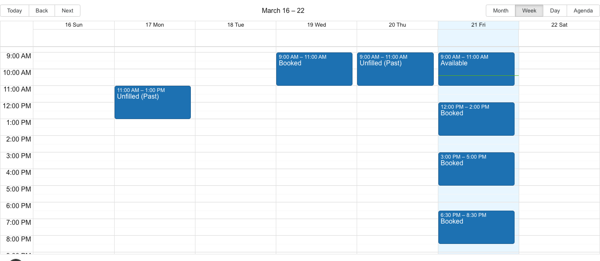
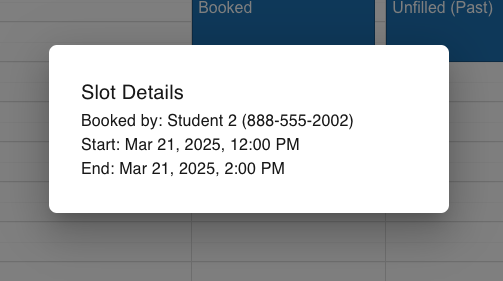
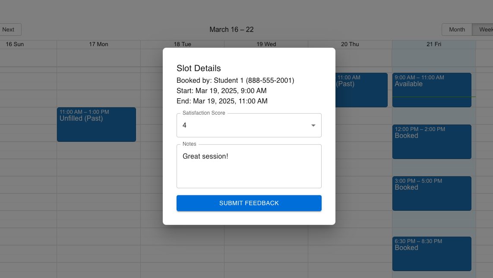
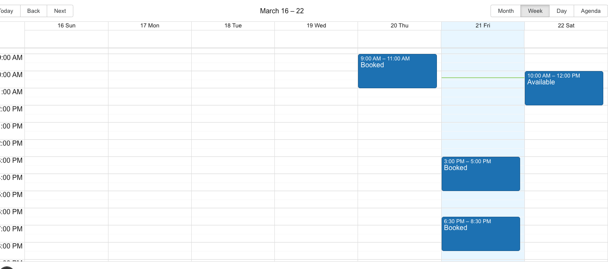
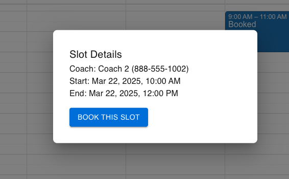
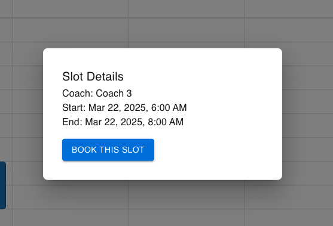

# Slots App

## Overview
This project is a full-stack web application for managing coaching slots and bookings.

### Setup
**Clone the repo**

---

## Backend (Rails API)
1. **cd into backend repo**
```bash
cd stepful-slots-backend
```

2. **Install dependencies**
```bash
bundle install
```

3. **Database Setup**
```bash
rails db:create
rails db:migrate
rails db:seed
```

4. **Start the server**
```bash
rails s
```

### Features
- RESTful API for Users and Slots
    - list all users
    - list all slots for user (with additional available slots for students)
    - update a slots notes/satisfaction score (coach only)
    - book a slot (student only)
- Strong parameter validation and eager loading
- Models with validations
- PostgreSQL

### Decision
- Metadata on slots is fairly light (notes/score) so did not split this into its own model referencing slots
- Since there's a singular calendar view, created dynamic index for student and coaches slots

### Future Features
- increase validation coverage
    - phone number format
    - note length
    - slot start time logic (one one uniq start time/no overlap)
- split endpoints for students and coaches slots

---

## Frontend (Next.js)

### Setup
1. **cd into frontend repo**
```bash
cd stepful-slots-frontend
```

2. **Install dependencies**
```bash
npm install
```

3. **Start the development server**
```bash
npm run dev
```

4. **Navigate to http://localhost:4000**

5. **Select User (Top Left)**

### Key Features
- Interactive calendar view for slot management
- Role-based user flows:
  - **Students**: view & book available slots, see coach phone number on booked slots
  - **Coaches**: view/create slots and leave satisfaction scores & notes for past booked appointments
- Pessimistic ui updates after booking or submitting feedback
- centralized API calls
- Styled with Material-UI

### Decisions
- Resused same components for students/coaches with conditional rendering
- Most state is managed at the parent level and propegated down

### Future improvement
- logic can be simplified by creating different components for each view version (depending on role)
- add better error handling/reporting
- implement more frontend validation

### Example Views

#### Coach





#### Student


